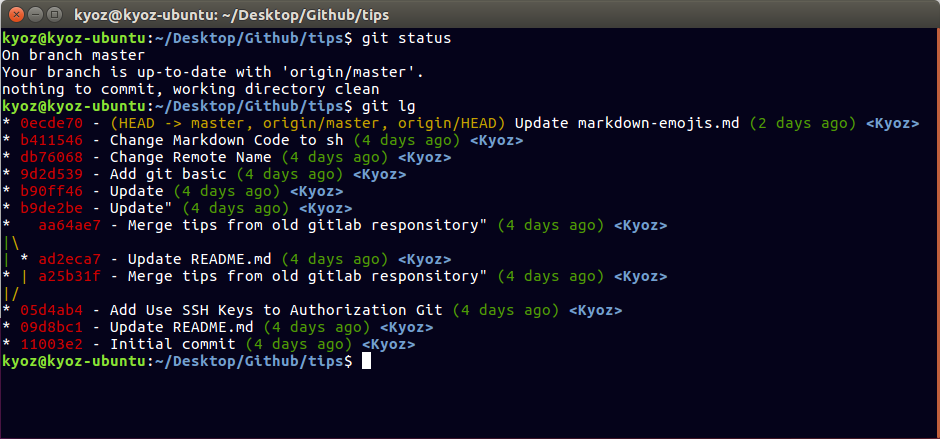

Just make an alias. Copy and paste the line below on your terminal:

```sh
git config --global alias.lg "log --color --graph --pretty=format:'%Cred%h%Creset -%C(yellow)%d%Creset %s %Cgreen(%cr) %C(bold blue)<%an>%Creset' --abbrev-commit"
```

And every time you need to see your log, just type in

```sh
git lg
```



Or, if you want to see the lines that changed

```sh
git lg -p
```
